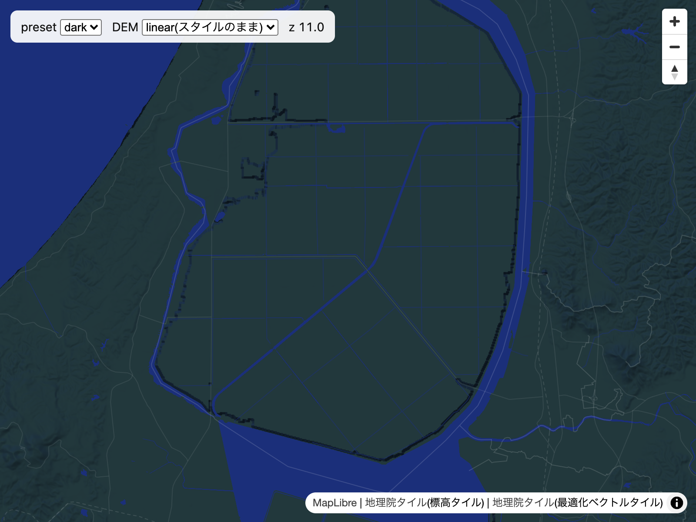
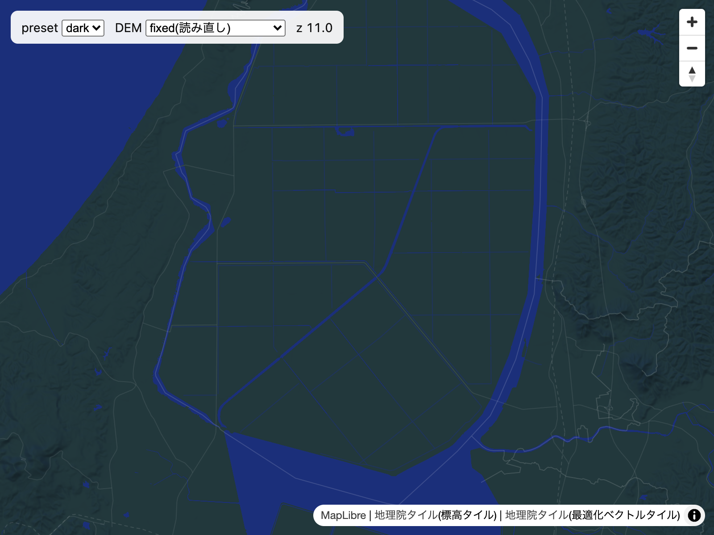
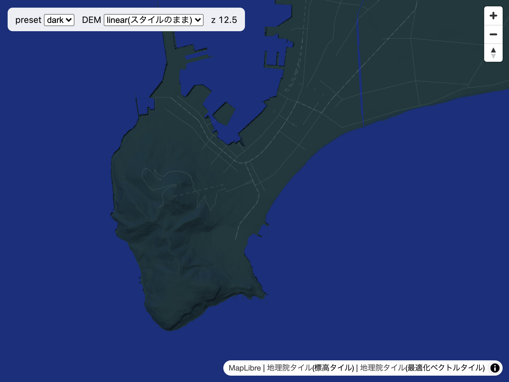
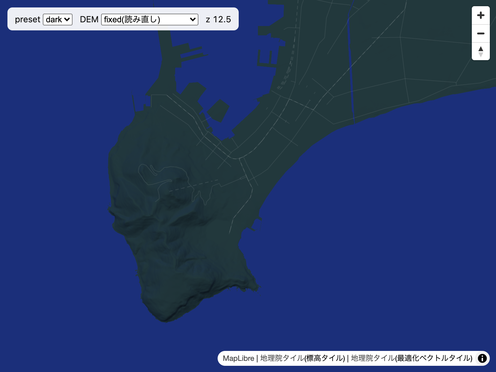

# gsi-field-notes

[](https://github.com/rihito-dev/gsi-field-notes/actions/workflows/check.yml)

**Field notes and a starter MapLibre style for GSI (国土地理院) vector tiles — observed from the actual tiles.**

国土地理院の最適化ベクトルタイルと標高タイルを MapLibre で使うための、最小構成のスタイルと、
実際のタイルを復号して確かめたことの記録(野帳)です。

色はプリセットとして分けてあり、差し替えるだけで別の見た目になります。

## Field notes

| ノート | 状態 | 要点 |
|---|---|---|
| [海と陸の表し方](notes/land-and-sea.md) | 観測済み・目視確認 | z4–z7 では海が WA に入っておらず、陸が AdmArea の面として来る。z8 から逆になる |
| [居住地名の注記コード](notes/place-label-codes.md) | 観測済み | 居住地名のコードは縮尺帯で系列が分かれる(13xx は z4–z7、14xx は z8–z10) |
| [標高タイルの復号](notes/dem-png-decoding.md) | 観測済み・目視確認・対処を実装 | 線形の custom encoding では、データなしが約 83,886 m、海面下が約 167,772 m と読まれ、海岸や干拓地の縁に黒い線が出る。読み直すプロトコルで消える |
| [外部タイルが届かないとき](notes/loading-without-external-tiles.md) | 未検証 | 自前のデータは `load` ではなく `style.load` で足す |

観測は決めた地点の真上のタイルだけを見た標本です。状態の意味と限界は [notes/README.md](notes/README.md) にあります。

## Before / after: 標高タイルの読み方

スタイルのまま(線形の custom encoding)だと、海面下の土地や海岸の縁に黒い線が出ます。
[`src/gsi-dem-protocol.js`](src/gsi-dem-protocol.js) で読み直すと消えます。

| linear(スタイルのまま) | fixed(読み直し) |
|---|---|
|  |  |
|  |  |

上: 八郎潟干拓地(z11、海面下の土地)。下: 函館(z12.5、普通の海岸)。いずれも dark プリセット。
画像は地理院タイル(最適化ベクトルタイル・標高タイル)を加工して作成し、
[`scripts/capture_comparisons.mjs`](scripts/capture_comparisons.mjs) で撮り直せます。

## Quick start

スタイルは [`styles/`](styles/) にある JSON をそのまま読み込めます。ベクトルタイルは PMTiles
形式で配信されているので、[pmtiles](https://github.com/protomaps/PMTiles) のプロトコルを登録します。

```html
<link rel="stylesheet" href="https://cdn.jsdelivr.net/npm/maplibre-gl@6.11.2/dist/maplibre-gl.css">
<script src="https://cdn.jsdelivr.net/npm/pmtiles@4.5.0/dist/pmtiles.js"></script>
<div id="map" style="height: 100vh"></div>
<script type="module">
  import { Map, addProtocol } from "https://cdn.jsdelivr.net/npm/maplibre-gl@6.11.2/dist/maplibre-gl.mjs";
  addProtocol("pmtiles", new pmtiles.Protocol().tile);
  new Map({ container: "map", style: "styles/dark.json", center: [142.8, 43.4], zoom: 6 });
</script>
```

### 標高タイルを正しく読む(任意)

スタイルは標高タイルを線形の式で読んでおり、海岸や海面下の土地の縁に黒い線が出ます
([ノート](notes/dem-png-decoding.md))。[`src/gsi-dem-protocol.js`](src/gsi-dem-protocol.js) を足すと、
画素ごとに地理院の仕様どおりに読み直します。

```js
import { createGsiDemProtocol, withFixedDem } from "./src/gsi-dem-protocol.js";
addProtocol("gsidem", createGsiDemProtocol());
const style = withFixedDem(await (await fetch("styles/dark.json")).json());
new Map({ container: "map", style });
```

### デモ

デモはリポジトリの直下でサーバを立てて開きます。

```sh
python3 -m http.server 8765
# http://localhost:8765/demo/  (?preset=light, ?dem=fixed で切り替え)
```

## プリセットと色

[`presets/`](presets/) の JSON は色と陰影の強さだけを持ち、スタイルの構造(ソース・レイヤ・
フィルタ)は [`scripts/build_styles.py`](scripts/build_styles.py) だけが持ちます。

| プリセット | 内容 |
|---|---|
| `dark` | [Orometry](https://orometry.com) の地図から切り出した暗色 |
| `light` | 色だけを差し替えた例 |

新しいプリセットは `presets/<name>.json` を足して生成します。標準ライブラリだけで動きます。

```sh
python3 scripts/build_styles.py          # styles/<name>.json を生成
python3 scripts/build_styles.py --check  # 生成物が最新かを確かめる(CI で実行)
```

## 観測を再現する

```sh
python3 -m venv .venv
. .venv/bin/activate
python -m pip install -r requirements.txt
cd scripts
python observe_vector_tiles.py   # data/observations/vector_tiles.csv
python observe_dem_png.py        # data/observations/dem_png.csv
```

地理院のサーバへは 1 秒以上の間隔を空けて順番に要求します(2026-09-25 の実行ではベクトルタイルで 66 件、標高タイルで 24 件)。
取得したタイルは集計にだけ使い、リポジトリには保存しません。観測日時と対象ファイルの版
(Last-Modified / ETag)は `data/observations/*.meta.json` に残ります。タイルは更新されるので、
同じ結果になるとは限りません。

## Repository

```text
presets/        色の指定(プリセット)
styles/         生成された MapLibre スタイル(コミットしてある)
notes/          野帳。実際のタイルを見てわかったこと
data/observations/  観測スクリプトの出力
src/
  gsi-dem-protocol.js     標高タイルを読み直すプロトコル(任意)
tests/          src/ のテスト(npm test)
scripts/
  build_styles.py         プリセットからスタイルを生成する
  observe_vector_tiles.py ベクトルタイルのレイヤと vt_code を数える
  observe_dem_png.py      標高タイルの画素を2通りに復号して比べる
  capture_comparisons.mjs デモを headless Chrome で撮影し docs/images/ に書く
demo/           スタイルを表示するだけのページ
docs/images/    README とノートの比較画像
```

## 出典とライセンス

- 地図の表示には、国土地理院の[地理院タイル](https://maps.gsi.go.jp/development/ichiran.html)
  (最適化ベクトルタイル・標高タイル)とフォントを使います。出典表示はスタイルの `attribution` に入れてあります。
  利用条件は[国土地理院コンテンツ利用規約](https://www.gsi.go.jp/kikakuchousei/kikakuchousei40182.html)を確認してください
- 最適化ベクトルタイルの仕様は [gsi-cyberjapan/optimal_bvmap](https://github.com/gsi-cyberjapan/optimal_bvmap) にあります
- このリポジトリのコード・スタイル・ノートは [MIT](LICENSE) です。地理院のデータそのものには及びません

## Deliberate limits

- 観測は北海道の数地点での標本で、全国・全タイルについての主張ではありません
- vt_code の意味は、地理院の仕様書とはまだ突き合わせていません。スタイルの判断は、観測と実際の表示にもとづいています
- 標高タイルの読み直しは JavaScript のプロトコルで行うので、スタイル JSON だけを使う場合は直りません([ノート](notes/dem-png-decoding.md))

## Where it came from

北海道 179 市町村の財政を地図で見る [Orometry](https://orometry.com) の開発中に見つけたことを、
汎用の形に切り出しました。
