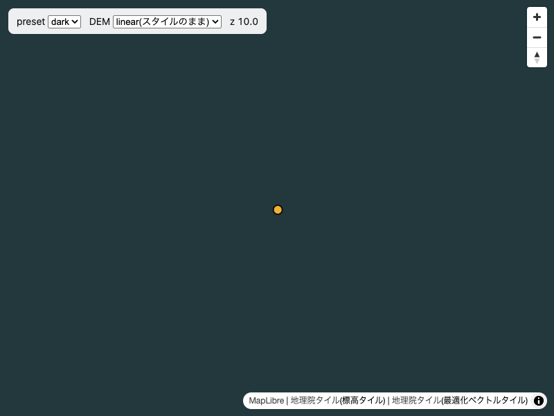

# 自前のデータは `style.load` で足す

- 状態: 観測済み(2026-09-26)
- データ: [`data/observations/offline.json`](../data/observations/offline.json)
- 試験: [`scripts/check_offline.mjs`](../scripts/check_offline.mjs)
- 実装例: [`demo/index.html`](../demo/index.html)

## 何が起きたか

Orometry の開発中(2026-08-18)に、自前の GeoJSON を `map.on("load")` の中で足していたところ、
地理院のサーバへ届かない環境では地図が**完全に空**になった。地理院の基図が出ないだけでなく、
ローカルに置いてある自前のデータまで描画されなかった。

## 原因

MapLibre の `load` は、スタイルのソースが揃って最初の描画が終わるまで発火しない。
このリポジトリのスタイルのソース(`gsi` と `gsi-dem`)はどちらも外部のホストにあるので、
そこへ届かなければ `load` は来ない。自前のデータは外部と無関係なのに、発火待ちに巻き込まれる。

## 対処

`style.load` で足す。スタイルの JSON を読み終えた時点で発火するので、タイルが来なくても
自前のデータは出る。

```js
map.on("style.load", async () => {
  if (map.getSource("local")) return; // setStyle のたびに再発火するので二重追加を防ぐ
  const data = await fetch("./local.geojson").then((r) => r.json());
  map.addSource("local", { type: "geojson", data });
  map.addLayer({ id: "local-point", type: "circle", source: "local" });
});
```

自治体の庁内網のように、外部ホストが許可リストから漏れることがある環境で効く。

## 試験

headless Chrome の起動引数で地理院のホスト(`cyberjapandata.gsi.go.jp`・`gsi-cyberjapan.github.io`)の
名前解決を差し替え、3つの環境でデモを開いて 20 秒待った。遮断が効いていることは、
ページから地理院のタイルを直接取得して確かめた(`gsi_probe`)。

| 環境 | 地理院への取得 | `load` | `style.load` | `isStyleLoaded()` | 自前の点 |
|---|---|---|---|---|---|
| 遮断なし(比較用) | HTTP 200 | 来た | 来た | true | 描かれた |
| 名前解決に失敗(すぐ失敗する) | TypeError | **20 秒来なかった** | 来た | true | 描かれた |
| 応答しないアドレス(返ってこない) | TimeoutError | **20 秒来なかった** | 来た | **false** | 描かれた |

標高タイルの読み方(linear / fixed)を変えても結果は同じだった。



応答しないアドレスへ向けた環境の画面。地理院の基図は1枚も来ていないが、ローカルに置いた点は描かれている。

- **どちらの遮断でも `load` は来なかった。** `load` で自前のデータを足していたら、この点は出ない
- **`style.load` はどちらでも来て、自前の点は描かれた**
- Orometry で見た「`isStyleLoaded()` が false のまま」は、応答が返ってこない環境でだけ再現した。
  すぐに失敗する環境では true になる。庁内網がどちらの振る舞いをするかは環境による

## 限界

- 待ったのは 20 秒で、それより後に `load` が来るかは見ていない。応答しないアドレスへの接続は、
  ブラウザの接続タイムアウトで失敗に変わるので、長く待つと結果が変わる可能性がある
- 実際の庁内網(プロキシ・証明書の差し替え・許可リスト)は再現していない。名前解決の差し替えは、
  「届かない」ことの近似である
- `events_ms` の時刻は文書の読み込み開始からの経過で、初回だけ CDN からの読み込みを含む
